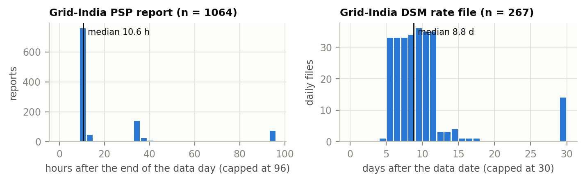
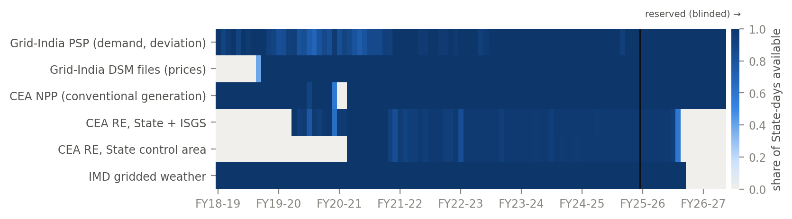

# The data

Every number in this research comes from official Government of India publications. Nothing is taken from
private aggregators, and no missing value is filled in silently.

## Where the data come from

| Agency | Product | What it gives | Used from |
|---|---|---|---|
| Grid Controller of India (Grid-India) | Daily Power Supply Position (PSP) report | State energy met, peak demand, scheduled and actual drawal, deviation, shortage; all-India frequency | 1 Apr 2018 |
| Grid-India | Daily PSP report, `TimeSeries` sheet | All-India 15-minute SCADA values: demand met, nuclear, wind, solar, hydro, gas, thermal, other generation, net demand, frequency, net exchange (and storage from 1 Jun 2026) | 4 Nov 2024 |
| Grid-India | Deviation Settlement Mechanism (DSM) files | Deviation rates, day-ahead and real-time market prices for each bid area and 15-minute block | 19 Dec 2018 |
| Central Electricity Authority (CEA) | National Power Portal daily generation | Conventional generation by station and fuel | 1 Apr 2018 |
| CEA | Daily renewable energy reports | Renewable generation by State | 1 Jul 2019 to 18 Nov 2025 (publication ended) |
| CEA | CO₂ baseline database | Emission factors by station | — |
| India Meteorological Department (IMD) | Gridded rainfall and temperature | Weather averaged over each State | 1 Apr 2018 to 31 Dec 2025 |

The original files are not copied into this repository: the agencies publish them but give no open licence for
copying. Each source folder keeps a `MANIFEST.csv` with the URL, download time, size and SHA-256 of every file,
and the scripts in `India_Grid_Study/codes/scripts/acquire/` download them again. A rebuilt panel is checked against the
published content hash.

When each report becomes public matters as much as what it says: the PSP report for a day appears about 10.6 hours
after the day ends (median), the DSM price file about 8.8 days after.

## Dataset 1: the State-day panel

`India_Grid_Study/data/processed/refused_state_day.parquet`

| | |
|---|---|
| One row | one Grid-India State control area on one calendar day |
| Areas | 34 (30 States and Union Territories, DNH & DD merged, Chandigarh, Puducherry, DVC) |
| Period | 1 April 2018 to 31 August 2026 (3,075 days) |
| Size | 104,550 rows × 107 columns, 10.17 million non-missing values |
| Column groups | demand, deviation, conventional generation, renewables, prices, carbon, system stress, regional and national values, weather, calendar, availability, quality flags, keys |
| Check | `CHECKSUM.txt`: a SHA-256 of the content that does not depend on row order; a rebuild reproduces it exactly |

Every column is described in `India_Grid_Study/data/docs/FIELD_REGISTRY.csv`: its source, unit, how many days after the
data day it becomes public (its *availability lag*), and its missing share. The forecasting code uses a column only
after its lag has passed. More detail: `India_Grid_Study/data/docs/DATASHEET.md`, `QC_REPORT.md`, `SOURCE_REGISTRY.md`.

## Dataset 2: the all-India series

| File | What it holds |
|---|---|
| `refused_allindia_15min.parquet` | 15-minute SCADA values, data dates 4 November 2024 to 13 September 2026 (674 days with data), with flags for missing, out-of-range and frozen values |
| `refused_allindia_hourly.parquet` | hourly means of the same series |
| `refused_allindia_hourly_prices.parquet` | hourly national day-ahead and real-time market clearing prices, from the DSM files |

Built by `India_Grid_Study/codes/scripts/build/b09_psp_timeseries.py` and `b10_hourly_prices.py`. The quality report is
`India_Grid_Study/data/docs/ALLINDIA_15MIN_QC.md`. Two things to know:

- From 1 June 2026 the report adds storage demand (pumped storage and battery charging, now included in demand
  met) and storage generation (no longer counted in hydro). Columns are matched by their header names, so the
  change does not shift values; net demand (demand met minus wind and solar) is defined the same way throughout.
- These are operational SCADA values. Grid-India notes they can contain telemetry errors and that they cover
  only what is seen by the transmission system, not rooftop or distribution-connected generation.

## Data from other countries

The forecast-correction method was first tested on public data from New York (NYISO), 46 European transmission
areas and 60 UCI electricity clients. Those results are kept in `Forecast_Correction_India/Other_Countries/` only to
compare with the Indian results. The raw files are not redistributed; the download scripts there fetch them.

## Licence

The processed Indian data and their documentation: CC BY 4.0. Please cite the Zenodo record
(DOI 10.5281/zenodo.23194781) and name the original sources: Grid-India, CEA and IMD.
