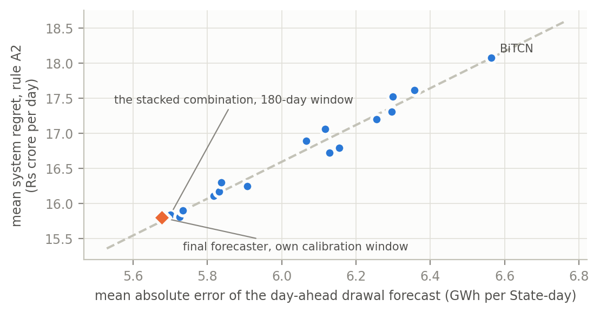
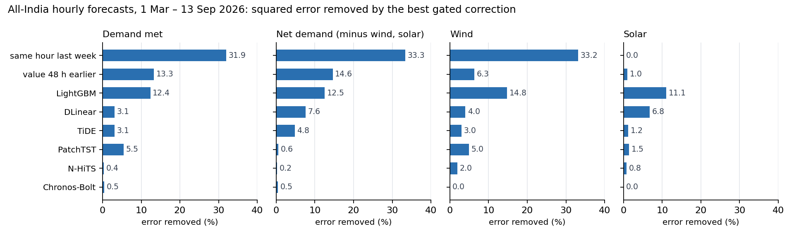

# Results

Every number below is read from a result file in this repository; the file is named under each table. Each
pre-registered test was written down and frozen before the evaluation data were opened, and the tests that were
**not** supported are listed next to those that were.

How a test is decided: a one-sided test at 5 %, Holm-corrected within its family (Benjamini–Yekutieli across all
tests is also reported in the files), with 7-day block bootstrap intervals. A threshold test passes only if the
threshold is met.

---

## 1. The State-day study (34 State control areas)

Evaluation period: 1 April 2025 to 31 August 2026, not loaded during development.
**35 of 52 pre-registered tests supported.**

| Family | What it tests | Supported |
|---|---|---|
| F1 | Forecast accuracy, interval calibration and the cost of publication delay | 20 of 20 |
| F2 | Context gating against plain combination, and the carbon block | 7 of 18 |
| F3 | Consequence-aware assessment of deviations | 1 of 2 |
| F4 | Risk-aware scheduling and the forecast-to-decision chain | 6 of 9 |
| F5 | Refining a forecast correction (the question of section 2, on the State panel) | 1 of 3 |

File: `India_Grid_Study/results/tables/confirm_hypotheses.md`. An independent rescoring of the stored predictions
reproduces this table exactly (`India_Grid_Study/results/audit/INTEGRITY.md`).

### Forecasting

Scaled error (MASE) on the evaluation period; lower is better.

| Target | Final forecaster | Seasonal naive |
|---|---|---|
| T1 demand met | 0.892 | 1.338 |
| T2 actual drawal | 0.922 | 1.339 |
| T3 conventional generation | 0.859 | 1.130 |
| T4 renewable generation | 1.107 | 1.615 |
| T5 day-ahead price | 0.741 | 1.027 |

- The final forecaster for each target was fixed on a calibration year before the evaluation: stacked weights for
  T1 and T2, an equal-weight average of the best few models for T3 and T5, Chronos-2 alone for T4.
- 80 % and 90 % intervals: measured coverage 0.778–0.802 and 0.886–0.899, inside the ±5 point band on every target.
- **Cost of late data:** using reports only once they are published raises the error by 15.1 % (drawal) to
  137.7 % (price), compared with pretending every report arrives at once.

### Scheduling and deviation charges

System-wide daily regret in Rs crore over 516 evaluation days (cost above the best schedule in hindsight).
J = half the mean plus half the CVaR at 0.9. Lower is better.

| Schedule rule | Mean | CVaR 0.9 | J |
|---|---|---|---|
| Published schedule (what actually happened) | 18.54 | 47.47 | 33.00 |
| Forecast median | 15.92 | 41.71 | 28.82 |
| One fixed risk level (A2) | 15.80 | 38.51 | 27.15 |
| Learned policy (PPO) | 15.64 | 39.07 | 27.35 |

- **A better forecast lowers the charge.** Same rule, same settings, only the forecast changed: mean regret falls
  by 0.2914 Rs crore per day (interval −0.4522 to −0.1457, Holm p = 5 × 10⁻⁵).
- **No adaptive rule beats a well-chosen fixed risk level.** The learned policy is not distinguishably better than
  A2, and the coupled and system-tail rules are not better either.
- **Deviation assessment (negative result):** the consequence-aware measure does not rank deviations better than
  energy alone (estimate 0.0108, interval −0.0154 to 0.0351). Forecast information does beat a shuffled placebo.

File: `India_Grid_Study/results/tables/confirm_o5_summary.md`.

### Additional analyses (run after scoring, not pre-registered)

| Finding | Value |
|---|---|
| Money value of accuracy | 2.63 Rs crore per day for each GWh of mean drawal-forecast error per State-day (interval 2.32 to 2.89), across 16 forecasters |
| Where the best fixed risk level sits | median 0.58; it follows the ratio of deviation rate to market price (rank correlation 0.87), not forecast uncertainty (0.06) |
| Limit of adaptive risk levels | choosing the level by uncertainty, stress, price ratio or State, even with hindsight, gains at most 0.7 % |
| One correction gate, in energy | for drawal, one fixed gate removes 13,374 GWh a year of forecast error over all 34 areas (interval 10,273 to 17,003); finer gates were significantly worse in 9 of 36 cases and better in 3 |
| Prices are different | for the day-ahead price, the fixed gate is worse than no correction (mean absolute error 1,485 against 1,008 Rs/MWh); a gate re-learned over time helps (956) |

Files: `India_Grid_Study/results/extra/`.

---

## 2. The all-India hourly study (forecast correction)

Four hourly series from the Grid-India SCADA data: demand met, net demand (demand minus wind and solar), wind and
solar. Eight day-ahead forecasts were corrected: two simple ones (same hour last week; value 48 hours earlier) and
six learned ones (LightGBM, N-HiTS, PatchTST, TiDE, DLinear, Chronos-Bolt). Test months: 1 March to 13 September
2026, opened once in H100 job 34223 after the plan was frozen (tag `prereg-india-v1`).
**5 of 20 pre-registered tests supported** (plus one estimate without a test).

What the run shows:

- **Correction helps weak forecasts most.** It removed about a third of the squared error of "same hour last
  week" for demand, net demand and wind, 11–15 % for LightGBM, and almost nothing for N-HiTS and Chronos.
  The pre-registered test that this pattern holds across all 32 forecast-series pairs (IH-5) was not supported
  (rank correlation 0.13).
- **Choosing a finer gate from validation data did not work here.** PART did not predict whether a finer gate
  would help better than chance (0.625 sign accuracy, Holm p = 0.43), and prequential validation did not choose
  time policies well (0.425). The crossing condition was not confirmed on the Indian State simulation either
  (sign accuracy 0.718 and 0.746 against the 0.85 and 0.75 thresholds). On Indian data, PART is therefore a
  diagnostic, not a selection rule.
- **Keeping the gate updated costs nothing** (IH-6b, supported in 7 of 8 forecasts).
- **Energy:** correcting LightGBM's demand forecast cut deviation energy by 5,742 GWh a year (interval 3,601 to
  7,610) and the 99 % upward reserve by 805 MW. **But** the stylised imbalance cost rose by 469 Rs crore a year
  (interval 188 to 776), and the 99 % demand quantiles covered only about 72 % of test hours for both the
  corrected and the uncorrected forecast. The reserve figure compares two equally under-covering forecasts, so it is not a
  usable reserve level.
- **Uncertainty cells:** series × hour quantiles had lower 99 % pinball loss than global or per-series quantiles
  (both supported), but neither the series × hour nor the per-instance design reached the 98.5 % coverage the
  test required (0.87 and 0.73).

| Test | What it says | Estimate | Verdict |
|---|---|---|---|
| IH-1 (4 tests) | crossing condition and PART on the Indian State simulation | 0.718 / 0.746 / 0.825 / 0.375 | not supported |
| IH-2 | gate estimation needs more data | −0.029 | not supported |
| IH-3a, b, c | PART chooses refinements well | 0.625; −0.0013; −0.00005 | not supported |
| IH-4a (2 tests) | series × hour quantile cells | +264, +171 | supported |
| IH-4b | per-instance quantiles under-cover | 0.734 | not supported |
| IH-5 | weaker forecasts gain more | 0.13 | not supported |
| IH-6a (3 tests) | prequential choice of time policy | 0.425; +0.0016; −0.0038 | not supported |
| IH-6b | updating is free | 0.875 | supported |
| IH-7a, b | PART selection regret | +0.002; −0.0037 | not supported |
| IH-8a | less deviation energy | 5,742 GWh/yr | supported |
| IH-8b | less 99 % reserve | 805 MW | supported (see coverage caveat) |
| IE-8c | imbalance cost saved (estimate only) | −469 Rs crore/yr | cost rose |

Files: `Forecast_Correction_India/results/india/confirm/analysis/verdicts.json` and the tables beside it. Changes made
after the plan was frozen (thread and core limits after the cluster stopped three attempts before any forecast was
made) are listed in `Forecast_Correction_India/design/06_deviations_india.md`.

### State daily correction ladders (exploratory)

The same correction on the five daily State targets of the 34 control areas: simple forecasts lose 12–55 % of
their squared error, learned forecasts gain about nothing, and finer gates add nothing except the per-instance gate
for renewable generation. These periods had already been opened by the State-day study, so this is exploratory.
Files: `Forecast_Correction_India/results/india/explore/`.

---

## 3. Comparison with data from other countries

The same method, pre-registered earlier and tested on NYISO zonal load, 46 European transmission areas and 60
UCI clients: **19 of 23 tests supported**. There, PART did predict the sign of refinement gains (0.75) and a coarse
per-zone correction cut NYISO deviation energy by about 854 GWh a year and 99 % reserve by 234 MW at almost
unchanged reliability (99.2 % against 99.3 %), again without lowering imbalance cost.

| | Other countries | India (hourly) |
|---|---|---|
| Tests supported | 19 of 23 | 5 of 20 |
| PART predicts whether a finer gate helps | yes (0.75) | no (0.625, not significant) |
| Prequential choice of time policy | sign 0.75, but no regret gain | no |
| Correction lowers deviation energy | yes | yes |
| Correction lowers imbalance cost | no | no (cost rose) |

So the validation rules that worked on the comparison data did not carry over to India's all-India series, while
the energy effect and the missing cost effect did. Files: `Forecast_Correction_India/Other_Countries/`.

---

## 4. What is not claimed

- No adaptive or learned scheduling rule is shown to beat a well-tuned fixed rule.
- The consequence-aware deviation measure is not shown to beat the energy-only measure.
- The settlement used for scheduling is stylised (daily, without the frequency-linked rate).
- PART and prequential validation are not shown to select gates reliably on Indian data.
- The hourly 99 % quantiles under-cover in the test months, so no reserve-sizing claim is made from them.
- All Indian results cover one country; the State study's evaluation window is 17 months, the hourly study's 6½.

## 5. Early stages

What the earlier stages found, and why the work was rebuilt from official data: [`../Early_Versions/README.md`](../Early_Versions/README.md).
