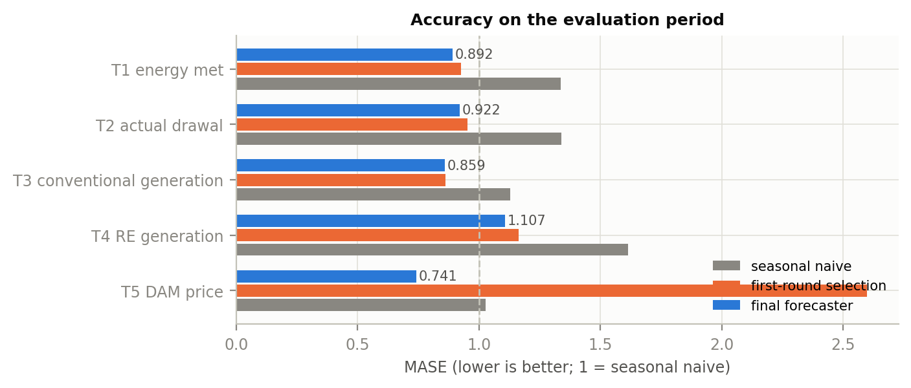
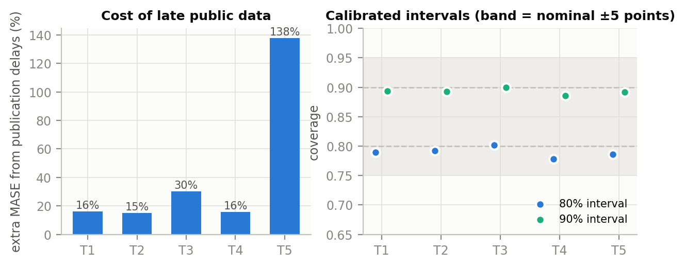
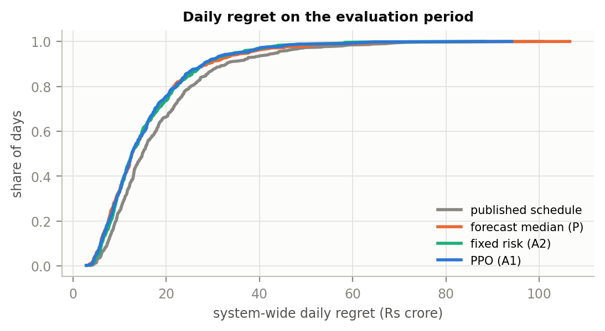
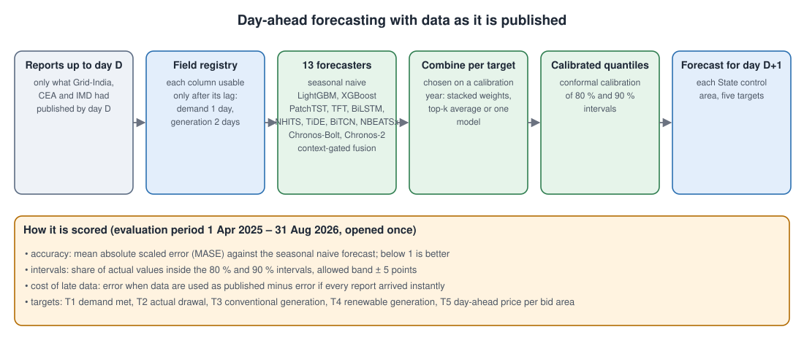
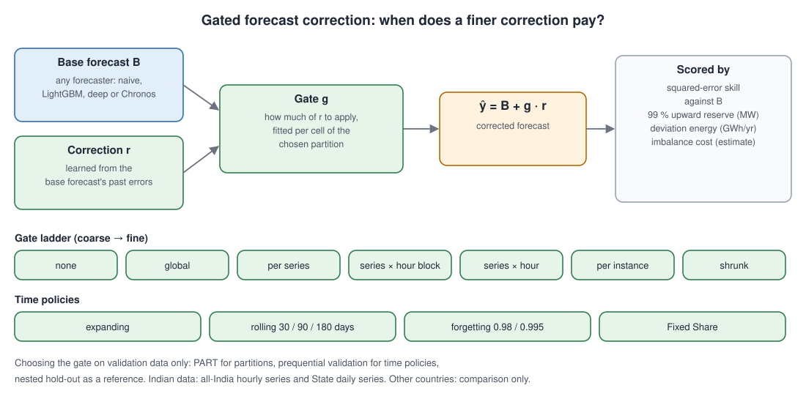

# RE-FUSED

**Renewable Energy Forecasting, Uncertainty, Schedule-Deviation, Evaluation & Decision-Support**

Research on India's power system, built only from official Government of India data: daily reports of Grid
Controller of India (Grid-India), the Central Electricity Authority (CEA) and the India Meteorological Department
(IMD). It asks four practical questions:

1. How well can each State's demand, drawal, generation and market price be forecast a day ahead, using data only
   as it is actually published?
2. How should a State set its day-ahead schedule when deviations from it are charged, and does a better forecast
   lower that charge?
3. When does adaptive correction of a day-ahead forecast actually help, and when does it only add noise?
4. Can all of this be released as an open dataset that anyone can rebuild from the original reports?

Author: **Rohit Kumar**, Centre for Artificial Intelligence, Dr. B. R. Ambedkar National Institute of Technology
Jalandhar. All computation ran on the institute's NVIDIA H100 cluster.

## What is in this repository

The folders are numbered in reading order. Folders 1 and 2 are the **final version** of the work;
[`FINAL_VERSION.md`](FINAL_VERSION.md) shows which code produced each final result, where the result is, and its run log.

| Folder | What it holds |
|---|---|
| [`1_india_data_forecasting_scheduling/`](1_india_data_forecasting_scheduling/) | **Main study.** Download and checking of every official report; the State-day panel and the all-India 15-minute and hourly series; day-ahead forecasting; deviation assessment; scheduling under deviation charges; all results and run logs |
| [`2_forecast_correction_india/`](2_forecast_correction_india/) | **Forecast correction on real Indian data.** Can a forecast be improved by learning its past errors, and how finely should that correction be tuned? Run on the all-India hourly series and the State daily series, with its frozen plan and run logs |
| [`2_forecast_correction_india/comparison_other_countries/`](2_forecast_correction_india/comparison_other_countries/) | The same correction method tested earlier on data from other countries (USA, Europe), kept only to compare with the Indian results |
| [`3_early_versions/`](3_early_versions/) | Code, results and notes of the earlier versions, and why the work changed direction |
| [`docs/`](docs/) | Plain-language guides: [data](docs/DATA.md), [results](docs/RESULTS.md), [how to rerun](docs/REPRODUCE.md), and all figures |

**Gated correction, in one line:** a forecast `B` is improved by adding a learned correction `r` of its usual
errors, scaled by a gate `g` between 0 and 1.5: `final forecast = B + g × r`. The gate can be one number for
everything, or one per series, per hour or per day; the study tests when a finer gate actually helps.

## The main findings, in short

All numbers come from result files in this repository. Each claim was written down and frozen before the
evaluation data were opened ([how](docs/figures/protocol.svg)).

- **Late data is expensive.** Using reports only after they are published, instead of pretending they arrive at
  once, raises day-ahead forecast error by 15 % (State drawal) to 138 % (market price).
- **The final forecasts beat the seasonal naive forecast on all five targets** (scaled error 0.74 to 1.11 against
  1.03 to 1.62), and the 80 % and 90 % intervals hold their promised coverage on every target.
- **A better forecast lowers the deviation charge.** With the scheduling rule held fixed, the final forecast
  lowers system regret by 0.29 Rs crore per day. Each GWh of mean drawal-forecast error per State-day adds about
  2.6 Rs crore per day.
- **No adaptive scheduling rule beats one well-chosen fixed risk level**, including a learned (PPO) policy.
- **One simple correction gate is usually enough.** On the State series, one fixed gate removes about 13,400 GWh
  a year of drawal forecast error across the 34 control areas; finer gates add little or make it worse. Market
  prices are the exception: there only a gate that keeps re-learning over time helps.
- **The dataset is open**: 34 State control areas, 1 April 2018 to 31 August 2026, 104,550 State-days × 107
  columns, DOI [10.5281/zenodo.22870921](https://doi.org/10.5281/zenodo.22870921).

Details, with intervals and the tests that were *not* supported: [docs/RESULTS.md](docs/RESULTS.md).

| | |
|---|---|
|  |  |
|  |  |

## How each part works

| | |
|---|---|
| Forecasting with data as published |  |
| Schedule and deviation charge |  |
| Gated forecast correction |  |

## Data and licences

Code: MIT licence ([`LICENSE`](LICENSE)). The processed Indian data, documentation and results: CC BY 4.0
([`LICENSE-DATA.md`](LICENSE-DATA.md)). The original report files are not copied here; they stay with the agencies
that publish them, and the download scripts fetch them again and check them against the recorded SHA-256 hashes.
Files too large for GitHub are in the Zenodo record ([list](docs/LARGE_FILES_ON_ZENODO.md)).

## Citation

See [`CITATION.cff`](CITATION.cff). Dataset: Rohit Kumar, *RE-FUSED: a provenance-tracked State-day panel of India's
power system*, Zenodo, DOI 10.5281/zenodo.22870921.
